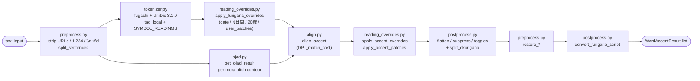

# `api/accent/` — Accent marking package

這個 package 提供兩個 FastAPI endpoint：

| Endpoint | 用途 |
|---|---|
| `POST /api/MarkAccent/` | 把日文標上 per-mora pitch accent + furigana（collected）|
| `POST /api/MarkAccent/stream/` | 同上，但 NDJSON 一行一個 chunk 即時 yield |

兩個 endpoint 共用同一套 chunking / pipeline，只有 delivery shape 不同。
（先前的 `MarkFurigana` endpoint 在本地 UniDic 化之後拿掉了 — 沒有 in-process
的純 furigana 等價物；要 raw tokenisation 的話請呼叫 `tokenizer.tag_local`。）

## Data flow



`pipeline.process_accent_chunk` runs every step above on each sentence-sized
chunk; `build_chunks` / `schedule_chunks` fan chunks across an in-flight
semaphore shared between the collected and streaming endpoints.

## Request toggles (`models.py`)

| Field | Type | Default | Meaning |
|---|---|---|---|
| `text` | `str` | required | The Japanese text to mark |
| `render_english_furigana` | `bool` | `False` | When `True`, ASCII-letter tokens (Apple, G2P) get their Japanese-style ruby. Pure-english tokens that already have a Japanese furigana (unit compounds like `53mm` / `33m/s` / `3kg`) keep ruby + accent regardless of this flag — the wipe only fires when `furigana` contains no kana. |
| `render_katakana_furigana` | `bool` | `False` | When `True`, pure-katakana tokens (`カメラ`) get their hiragana ruby. Per-mora pitch contour is returned either way. |
| `script` | `Literal["hiragana","katakana","romaji"]` | `"hiragana"` | Output script for every furigana field (top-level, per-mora, subword). Internal alignment stays hiragana; this is a response-shape switch. Romaji uses jaconv's default Hepburn-style table — no macrons. |

## Core types (`models.py`)

### `WordResult`

| 欄位 | 型別 | 說明 |
|---|---|---|
| `surface` | `str` | 原文 token |
| `furigana` | `str` | 該 token 的 hiragana 讀音 |
| `subword` | `list[WordResult]` | 由 `split_okurigana` 在 postprocess 填入，kanji + kana 混合 token 的分段（kanji 段帶 furigana，內嵌 kana 段 furigana=""）|

### `AccentInfo` (per-mora pitch)

| 欄位 | 型別 | 說明 |
|---|---|---|
| `furigana` | `str` | 該 mora 的 kana |
| `accent_marking_type` | `int` | 見下方表 |
| `length` | `int` | kana 字數 |

`accent_marking_type` 三種值，對應 OJAD HTML 的 CSS class：

| 值 | 意義 | OJAD class | 視覺 |
|---|---|---|---|
| `0` | LOW（或未知 / fallback）| (無 class) | 低音 |
| `1` | HIGH plateau | `accent_plain` | 高音平台 |
| `2` | FALL kernel | `accent_top` | 此 mora 之後音調下降 |

### `WordAccentResult` (MarkAccent 輸出)

| 欄位 | 型別 | 說明 |
|---|---|---|
| `surface` | `str` | 原文 token |
| `furigana` | `str` | 全 token 讀音 |
| `accent` | `list[AccentInfo]` | per-mora pitch list |
| `subword` | `list[WordResult]` | kanji+kana 分段（見上）|
| `kernel_absorbed` | `bool` | UniDic 說此 word 有 kernel 但 OJAD 對應 span 沒有 FALL — 通常表示在長 prosodic phrase 中位，kernel 被前後吸收 |

### Accent shape 速查

從 `accent` 陣列可以判斷整個 word 的音調型：

| Type | 判定條件 | 例 |
|---|---|---|
| 平板調 (Heiban) | 沒有 type=2，至少一個 type=1 | 学校 `[が:0 っ:1 こ:1 う:1]` |
| 頭高 (Atamadaka) | 第一個 mora 是 type=2 | 今日 `[きょ:2 う:0]` |
| 中高 (Nakadaka) | 中間某個 mora 是 type=2 | 山道 `[や:0 ま:1 み:2 ち:0]` |
| 尾高 (Odaka) | 最後一個 mora 是 type=2（FALL 落在 word 跟 particle 之間）| 橋 `[は:0 し:2]` |

## File responsibilities

| File | 角色 |
|---|---|
| `models.py` | Pydantic schemas（兩 endpoint 共用），含 `Request` toggles 與 strong-mode lexical-accent fields |
| `tokenizer.py` | fugashi + NINJAL UniDic 3.1.0 in-process tokeniser — `tag_local`，含 `SYMBOL_READINGS` fallback 把 `#`、`%`、`@` 等填入正確 katakana 讀音 |
| `preprocess.py` | 文字層 URL / `1,234` / `\d×\d` strip+restore、`has_japanese` gate、`split_sentences`、`READABLE_SYMBOLS`、`SYMBOL_READINGS` 表 |
| `ojad.py` | OJAD scrape — `gavo.t.u-tokyo.ac.jp/ojad/phrasing/index` + BeautifulSoup |
| `align.py` | Token ↔ OJAD mora DP alignment（Needleman-Wunsch）、`_match_cost`、edit distance、voicing fold、token 分類 |
| `reading_overrides.py` | Regex overrides（日期、N日間、20歳→はたち、曜日 `(土)` 等）+ POS-driven `apply_accent_patches`（ます/たい first-mora-FALL）+ 編譯 `USER_PATCHES` |
| `user_patches.py` | **使用者維護**的補丁表 — 針對 OJAD/UniDic 上游錯誤直接覆寫整段讀音 + accent（見下）|
| `postprocess.py` | Rendering polish：suppress punct/particle furigana、flatten heiban-particle、english/katakana toggles、`split_okurigana`、`convert_furigana_script` |
| `pipeline.py` | MarkAccent orchestrator — 串起 preprocess → tokenizer → overrides → ojad → align → patches → postprocess → restore → script convert；提供共用的 `build_chunks` / `schedule_chunks` |
| `routes.py` | FastAPI router + 兩個 endpoint handler（collected & streaming）|
| `__init__.py` | 對 `main.py` re-export `accent_router` |

依賴方向（無循環）：

```
routes.py  →  pipeline.py  →  align.py, ojad.py, tokenizer.py,
                              preprocess.py, postprocess.py,
                              reading_overrides.py  →  user_patches.py
                            ↘
                              models.py  ←  (所有層都 import models)
```

## Alignment algorithm (`align.py`)

`align_accent()` 用 Needleman-Wunsch-style DP 對 (token, ojad_entry) 進行
global alignment：`dp[i][j]` 是 token `[0..i)` 對到 OJAD `[0..j)` 的最低總
cost。對每個 (i, j) 我們嘗試讓 token i 吸收 `k ∈ [0, _K_MAX]` 個 OJAD entry，
per-token cost 來自 `_match_cost`。

各分類的 cost 規則（檢查順序對應 `_match_cost` 內的 branch）：

- **Punct token**：只能 k=0 (cost 0)，或 k=1 且 OJAD entry 是同 punct（cost 0）；其餘 `_INF`
- **English-compound（letters/digits/`-_.`）**：k=0 cost **0**（OJAD 常常完全 elide 英文 token，例：`ふりがなWhisper` OJAD 只回傳 `ふりがな` 4 morae）；k≥1 cost 0 up to `max(4, len*4)`，超過線性懲罰。早於 punct guard 處理是因為 OJAD 可能把 `Wifi.7` 標成 `Wifi。7`，那個 `。` 要被 english token 吃掉
- **OJAD punct guard**：OJAD 的 `、 。 , .` 等 entry 進入非 english-compound 的 non-punct token 一律 `_INF`，避免 leak
- **Readable-compound（`2%` 等）**：k≥1 cost 0 up to `max(4, len*4) + 8`
- **Numeric token**：同 numeric 但 upper 是 `max(4, len*4)`；對 span 內 empty OJAD entry 加 0.01 tiebreaker（避免 `19×19` 被切成 1+7）
- **Synthesized（base=None ∧ pos=None）**：override 合併出的 token（如 `20歳→はたち`），prescribed `furigana` 跟 OJAD 對同 surface 的讀音不一致時，給跟 readable-compound 一樣的 free-consume，避免 OJAD `にじゅっさい` 的 `さい` cascade 到下個 token。`apply_accent_overrides` 會 post-align rewrite，OJAD marks 在這層被 discard
- **Kana / kanji token**：對 rendaku-folded 字串跑 `_edit_distance`（sub=0.4, ins/del=1.0），預先用 length pre-filter（差 > 3 直接 `_INF`）

**Voicing fold (`_VOICING_FOLD`)**：比對前對 `が↔か, ぷ↔ふ` 等做 fold，吸收
rendaku / sequential voicing。

`_build_word_result` 把 (token, OJAD span) 轉成 `WordAccentResult`，包含
strong-mode 三欄位（`lexical_kernel`, `lexical_kernel_alts`,
`kernel_absorbed`）。Pure-punct token 直接 emit 空 `furigana` + 空 `accent`；
numeric / readable-compound 直接用 OJAD span 拼出 display furigana。

## Surface overrides + POS patches (`reading_overrides.py`)

兩層遞補在 DP align 之外：

**(1) Regex 全字串 override** —`OVERRIDES` list 由 `_day_of_week_overrides`
／`_date_overrides`／`_duration_overrides`／`_age_overrides`
／`_user_patch_overrides`（編譯自 `user_patches.USER_PATCHES`）組成，每條
規則是 `FuriganaOverride(pattern, replacements, description, pos_match=None)`：

- `apply_furigana_overrides(words: list[WordResult])` 在 OJAD align 之前
  跑，把 `4日` `27日` `1日間` `20歳` 等合併成單一 token
- `apply_accent_overrides(words: list[WordAccentResult])` 在 OJAD align
  之後再跑一次，把 furigana 跟 accent 一次換掉
- Pattern 用 `_DIGIT_CLASS = \d一二三四五六七八九十百千` 的 not-num
  lookbehind/lookahead 防止 `11日` 被誤射成 `1日`；`_numeric_pattern(n)` 同時
  接受 arabic / fullwidth / kanji 三種寫法
- `_apply` 算法：把 token surfaces 拼回 full_text、用 token boundary
  filter 過合法的 match，POS-driven `pos_match` callback 可以再 reject
- User patches 在 OVERRIDES list 最後，等長/等位的 match 由 `_collect_matches` 用 (start, -length) tiebreak，所以 user patch 不會干擾較長的內建 N日間 patterns

**(2) POS-driven `apply_accent_patches`** — 在 `(1)` 之後跑，per-token
inspect MA metadata 改 trailing accent。目前覆蓋：

- `_is_masu_auxiliary`：`pos=助動詞 ∧ cType=助動詞-マス ∧ base=ます ∧
  surface.startswith("ま") ∧ cForm ∈ {終止形, 連用形}` → 第一個 mora FALL，其餘 LOW
- `_is_tai_auxiliary`：對 `cType=助動詞-タイ ∧ base=たい` 做同樣 patch

Override-replaced token 因為 `pos=None` 自動被 self-check predicate 拒絕，
所以兩層可以安全串接。

## User patches (`user_patches.py`)

純資料檔，給上游 OJAD/UniDic 不可修但本地可覆寫的 case 用。

格式：

```python
USER_PATCHES: dict[str, tuple[tuple[str, str, tuple[int, ...]], ...]] = {
    "33m/s": (
        ("33", "さんじゅうさん", (0, 1, 1, 1, 1, 1)),
        ("m/s", "めーとるまいびょう", (1, 1, 1, 1, 1, 1, 1, 1)),
    ),
    "他の": (
        ("他", "ほか", (2, 0)),   # atamadaka
        ("の", "の", (0,)),
    ),
}
```

每個 segment 永遠是 3-tuple `(surface, furigana, accent_ints)`：

- `accent_ints` 是 per-mora 的整數 tuple，值 `0`=LOW / `1`=HIGH / `2`=FALL
- 長度必須等於 `furigana` 的 mora 數（小假名 `ゃ/ゅ/ょ` 附在前一 mora，所以 `じゅ` 算一格）
- segment surfaces 串接必須等於 dict key

驗證失敗（segment 不是 3-tuple、surface 長度對不上、accent 長度跟 mora 數對不上）會在啟動時 warn，整 entry 跳過。

常見 shape：

| 型 | accent_ints 範例 (3 morae) |
|---|---|
| heiban | `(1, 1, 1)` |
| atamadaka | `(2, 0, 0)` |
| nakadaka | `(0, 1, 2, 0)`（FALL 落在中間） |
| odaka | `(0, 0, 2)` |
| all-LOW（particle 風）| `(0, 0, 0)` |

新增 patch 流程：

1. 透過 `POST /api/MarkAccent/` 重現 misalignment，確認是 deterministic
2. 在 `user_patches.py` 加一筆，第一次先 heiban (`(1,1,…)`)
3. 跑 `./scripts/run_10_tests.sh` 看 30-fixture 沒回歸
4. 視聽感調 accent_ints

## Postprocess passes (`postprocess.py`)

`pipeline` 在 align + overrides + patches 完成後依序跑：

1. `flatten_heiban_particle_accent` — 平板調 noun 之後的 `の/な/は/が` 把
   accent 整列改成 LOW，避免 OJAD 的 HIGH plateau overlay 噪音
2. `suppress_punct_furigana` — 把純 punct token 的 furigana / accent 清空。
   `SYMBOL_READINGS` 裡的 symbol（`#`、`%`、`@` …）會被排除，不會被誤判成
   punct 而清掉 ruby
3. `apply_furigana_toggles` — `render_english_furigana` /
   `render_katakana_furigana` toggle off 時對 pure-English token 清
   furigana+accent，pure-katakana token 只清 furigana。**Unit compounds**
   (`53mm`, `33m/s`, `3kg`) 因為 furigana 含 kana 而被排除，不會被誤殺
4. `suppress_particle_furigana` — `pos == "助詞"` 的 token 清 top-level
   `furigana`，留 per-mora `accent` 給 client 繪 pitch overlay
5. `split_okurigana` — 對 kanji + kana 混合 surface（`聞き分け`、`取り組み` …）
   填 `subword[]`：kanji run 段帶 furigana 切片、in-line kana 段 `furigana=""`。
   無法對齊（reading mismatch / 無 kanji）的 token 跳過，留 flat 形式
6. `restore_*` (preprocess) — 還原 URL / `1,234` / `\d×\d`
7. `convert_furigana_script` — 把 top-level `furigana`、每個 `AccentInfo.furigana`、
   每個 `subword[].furigana` 轉成 request 指定的 `script`。預設 `"hiragana"` 也
   會把 OJAD 偶爾回的 katakana per-mora 統一化（例：`ライター` 的 `accent[]` 從
   `[ラ,イ,タ,ー]` 轉成 `[ら,い,た,ー]`）

每個 pass 都是 pure function（input list 不被 mutate）並 idempotent。Order
matters — 例如 toggles 必須在 particle-suppression 之前，script convert 必須
最後跑。

## Local UniDic tokeniser (`tokenizer.py`)

`tag_local(text) -> list[WordResult]` 用 `fugashi.Tagger()`。Singleton tagger
（dictionary 載入 ~774 MB，per-request 建構太貴）。Field mapping：

| WordResult | UniDic feature |
|---|---|
| `surface` | `token.surface` |
| `furigana` | `jaconv.kata2hira(feat.kana)`，fallback：`feat.pron` → `SYMBOL_READINGS[surface]`（給 `#`、`%` 等 UniDic 沒讀音的 symbol）→ surface |
| `base` | `_strip_lemma_gloss(feat.lemma)` (去掉 `コーヒー-coffee` 的英文 gloss) |
| `pos` | `feat.pos1`（top-level POS：動詞 / 助動詞 …）|
| `pos1` | `feat.pos2`（subcat：一般 / 普通名詞 …）|
| `conjugation_type` | `feat.cType` |
| `conjugation_form` | `feat.cForm` |
| `lexical_kernel` / `lexical_kernel_alts` | `_parse_atype(feat.aType)`（單 reading → primary；`"2,0"` → primary + alts）|

`*` 是 fugashi 的 null marker，`_none_if_null` 全部 mapping 成 `None`。
`feat.kana` 是 orthographic kana（`イソガシイ`，跟 OJAD 對得起來），`feat.pron`
是 phonological（`イソガシー` 含 chōonpu，會 align 不到）— 所以優先取 kana。

POS metadata 五欄位（`base`/`pos`/`pos1`/`conjugation_type`/`conjugation_form`）
在 `models.py` 用 `Field(exclude=True)` 標記，pipeline 內部要用（`apply_accent_patches`
靠它，align.py 也用 `base/pos is None` 偵測 override-synthesized token），
serialization 時 client 看不到。strong-mode 三欄位（`lexical_kernel`,
`lexical_kernel_alts`, `kernel_absorbed`）會出現在 JSON。

## Adding endpoints / overrides

- **新 endpoint**：route 放 `routes.py`，演算法分層放 `tokenizer.py` / `align.py` /
  `ojad.py` / `reading_overrides.py` / `postprocess.py`，整合進 `pipeline.py`
- **使用者級補丁**（最常見）：直接加到 `user_patches.py` 的 `USER_PATCHES` dict —
  純資料、不寫 Python
- **Surface-level 結構性 override**（regex 模式、多重 surface 變體、POS 條件）：在
  `reading_overrides.py` 加新的 `_*_overrides()` 函式回傳 `FuriganaOverride` list，
  concat 進 `OVERRIDES`
- **POS-driven 規則**：在 `reading_overrides.py` 加 `_is_*_auxiliary` self-check
  + 對應的 `_patch_*` builder，掛進 `apply_accent_patches` 的 for 迴圈
- **新 SYMBOL_READINGS entry**：在 `preprocess.py` 的 dict 加一筆 `"X": "カタカナ"`
  — `tag_local` 跟 `suppress_punct_furigana` 都會自動跳過該 surface
