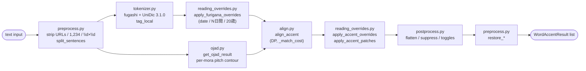

# `api/accent/` — Accent marking package

這個 package 提供兩個 FastAPI endpoint：

| Endpoint | 用途 |
|---|---|
| `POST /api/MarkAccent/` | 把日文標上 per-mora pitch accent + furigana（collected）|
| `POST /api/MarkAccent/stream/` | 同上，但 NDJSON 一行一個 chunk 即時 yield |

兩個 endpoint 共用同一套 chunking / pipeline，只有 delivery shape 不同。
（先前的 `MarkFurigana` endpoint 在本地 UniDic 化之後拿掉了 — 沒有 in-process
的純 furigana 等價物；要 raw tokenisation 的話請呼叫 `tokenizer.tag_local`。）

## Data flow



`pipeline.process_accent_chunk` runs steps 1–10 on each sentence-sized chunk;
`build_chunks` / `schedule_chunks` fan chunks across an in-flight semaphore
shared between the collected and streaming endpoints.

## Core types (`models.py`)

### `WordResult` (Yahoo Furigana 輸出)

| 欄位 | 型別 | 說明 |
|---|---|---|
| `surface` | `str` | 原文 token |
| `furigana` | `str` | 該 token 的 hiragana 讀音 |
| `subword` | `list[WordResult]` | kanji + kana 混合 token 的細分（遞迴）|

### `AccentInfo` (per-mora pitch)

| 欄位 | 型別 | 說明 |
|---|---|---|
| `furigana` | `str` | 該 mora 的 kana |
| `accent_marking_type` | `int` | 見下方表 |
| `length` | `int` | kana 字數 |

`accent_marking_type` 三種值，對應 OJAD HTML 的 CSS class：

| 值 | 意義 | OJAD class | 視覺 |
|---|---|---|---|
| `0` | LOW（或未知 / fallback）| (無 class) | 低音 |
| `1` | HIGH plateau | `accent_plain` | 高音平台 |
| `2` | FALL kernel | `accent_top` | 此 mora 之後音調下降 |

### `WordAccentResult` (MarkAccent 輸出)

| 欄位 | 型別 | 說明 |
|---|---|---|
| `surface` | `str` | 原文 token |
| `furigana` | `str` | 全 token 讀音 |
| `accent` | `list[AccentInfo]` | per-mora pitch list |
| `subword` | `list[WordResult]` | 從 Yahoo 透傳，不額外處理 |

### Accent shape 速查

從 `accent` 陣列可以判斷整個 word 的音調型：

| Type | 判定條件 | 例 |
|---|---|---|
| 平板調 (Heiban) | 沒有 type=2，至少一個 type=1 | 学校 `[が:0 っ:1 こ:1 う:1]` |
| 頭高 (Atamadaka) | 第一個 mora 是 type=2 | 今日 `[きょ:2 う:0]` |
| 中高 (Nakadaka) | 中間某個 mora 是 type=2 | 山道 `[や:0 ま:1 み:2 ち:0]` |
| 尾高 (Odaka) | 最後一個 mora 是 type=2（FALL 落在 word 跟 particle 之間）| 橋 `[は:0 し:2]` |

## File responsibilities

| File | 角色 |
|---|---|
| `models.py` | Pydantic schemas（兩 endpoint 共用），含 `Request` toggles 與 strong-mode lexical-accent fields |
| `tokenizer.py` | fugashi + NINJAL UniDic 3.1.0 in-process tokeniser — `tag_local` |
| `preprocess.py` | 文字層 URL / `1,234` / `\d×\d` strip+restore、`has_japanese` gate、`split_sentences`、readable-symbol 合併 |
| `ojad.py` | OJAD scrape — `gavo.t.u-tokyo.ac.jp/ojad/phrasing/index` + BeautifulSoup |
| `align.py` | Token ↔ OJAD mora DP alignment（Needleman-Wunsch）、`_match_cost`、edit distance、voicing fold、token 分類 |
| `reading_overrides.py` | Regex overrides（日期、N日間、20歳→はたち、曜日 `(土)` 等）+ POS-driven `apply_accent_patches`（ます/たい first-mora-FALL）|
| `postprocess.py` | Rendering polish：suppress punct/particle furigana、flatten heiban-particle、english/katakana toggles |
| `pipeline.py` | MarkAccent orchestrator — 串起 preprocess → tokenizer → overrides → ojad → align → patches → postprocess → restore；提供共用的 `build_chunks` / `schedule_chunks` |
| `routes.py` | FastAPI router + 兩個 endpoint handler（collected & streaming）|
| `__init__.py` | 對 `main.py` re-export `accent_router` |

依賴方向（無循環）：

```
routes.py  →  pipeline.py  →  align.py, ojad.py, tokenizer.py,
                              preprocess.py, postprocess.py,
                              reading_overrides.py
                            ↘
                              models.py  ←  (所有層都 import models)
```

## Alignment algorithm (`align.py`)

`align_accent()` 用 Needleman-Wunsch-style DP 對 (token, ojad_entry) 進行
global alignment：`dp[i][j]` 是 token `[0..i)` 對到 OJAD `[0..j)` 的最低總
cost。對每個 (i, j) 我們嘗試讓 token i 吸收 `k ∈ [0, _K_MAX]` 個 OJAD entry，
per-token cost 來自 `_match_cost(token, span_texts, is_numeric, is_punct,
is_readable_compound)`：

- **Punct token**：只能 k=0 (cost 0)，或 k=1 且 OJAD entry 是 punct（cost 0）；其餘 `_INF`
- **Numeric token**：沒有 token furigana 可比，接受 `k ∈ [1, max(4, len(surface)*4)]` cost 0；超過 cost 線性懲罰；對 span 內 empty OJAD entry 加 0.01 tiebreaker，避免 `19×19` 被切成 1+7
- **Readable-compound（`2%` 等）**：同 numeric 但 upper 多 8 morae 給 symbol kana 用
- **Kana / kanji token**：對 rendaku-folded 字串跑 `_edit_distance`（sub=0.4, ins/del=1.0），預先用 length pre-filter（差 > 3 直接 `_INF`）

額外規則：

- **OJAD punct guard**：OJAD 的 `、 。 , .` 等 entry 進入 non-punct token 的 span 一律 `_INF`，避免 `、` leak 到下一個 token 的 accent list
- **Voicing fold (`_VOICING_FOLD`)**：比對前對 `が↔か, ぷ↔ふ` 等做 fold，吸收 rendaku / sequential voicing
- **Readable-symbol pre-merge**：`(digit, %)` 在跑 DP 前先在 `preprocess.merge_readable_symbol_compounds` 合併成一個 token，避免 `パーセント` 的 morae leak 到 digit

`_build_word_result` 把 (token, OJAD span) 轉成 `WordAccentResult`，包含
strong-mode 三欄位（`lexical_kernel`, `lexical_kernel_alts`,
`kernel_absorbed`）。Pure-punct token 直接 emit 空 `furigana` + 空 `accent`；
numeric / readable-compound 直接用 OJAD span 拼出 display furigana。

## Surface overrides + POS patches (`reading_overrides.py`)

兩層遞補在 DP align 之外：

**(1) Regex 全字串 override** —`OVERRIDES` list 由 `_day_of_week_overrides`
／`_date_overrides`／`_duration_overrides`／`_age_overrides` 組成，每條規則
是 `FuriganaOverride(pattern, replacements, description, pos_match=None)`：

- `apply_furigana_overrides(words: list[WordResult])` 在 OJAD align 之前
  跑，把 `4日` `27日` `1日間` `20歳` 等合併成單一 token，讓 OJAD 的數字
  reading 落在正確的 phrase 邊界
- `apply_accent_overrides(words: list[WordAccentResult])` 在 OJAD align
  之後再跑一次，把 furigana 跟 accent 一次換掉
- Pattern 用 `_DIGIT_CLASS = \d一二三四五六七八九十百千` 的 not-num
  lookbehind/lookahead 防止 `11日` 被誤射成 `1日`；`_numeric_pattern(n)` 同時
  接受 arabic / fullwidth / kanji 三種寫法
- `_apply` 算法：把 token surfaces 拼回 full_text、用 token boundary
  filter 過合法的 match，POS-driven `pos_match` callback 可以再 reject

**(2) POS-driven `apply_accent_patches`** — 在 `(1)` 之後跑，per-token
inspect MA metadata 改 trailing accent。目前覆蓋：

- `_is_masu_auxiliary`：`pos=助動詞 ∧ cType=助動詞-マス ∧ base=ます ∧
  surface.startswith("ま") ∧ cForm ∈ {終止形, 連用形}` → 第一個 mora FALL，其餘 LOW
- `_is_tai_auxiliary`：對 `cType=助動詞-タイ ∧ base=たい` 做同樣 patch

`_PATCH_EXCEPTIONS = frozenset()` 留給未來真實發現的 false positive。
Override-replaced token 因為 `pos=None` 自動被 self-check predicate 拒絕，
所以兩層可以安全串接。

## Postprocess passes (`postprocess.py`)

`pipeline` 在 align + overrides + patches 完成後依序跑：

1. `flatten_heiban_particle_accent` — 平板調 noun 之後的 `の/な/は/が` 把
   accent 整列改成 LOW，避免 OJAD 的 HIGH plateau overlay 噪音
2. `suppress_punct_furigana` — 把純 punct token 的 furigana / accent 清空
   （`apply_accent_overrides` 把 bracket `(土)` 重建出 type-0 fallback，會
   重新把 punct 上 ruby — 這層 idempotent 地清掉）
3. `apply_furigana_toggles` — `render_english_furigana` / `render_katakana_furigana`
   toggle off 時對 pure-English token 清 furigana+accent，對 pure-katakana
   token 只清 furigana（保留 accent）
4. `suppress_particle_furigana` — `pos == "助詞"` 的 token 清 top-level
   `furigana`，留 per-mora `accent` 給 client 繪 pitch overlay

每個 pass 都是 pure function（input list 不被 mutate）並 idempotent。Order
matters：toggles 必須在 particle-suppression 之前，flatten 必須在 punct-
suppression 之前。

## Local UniDic tokeniser (`tokenizer.py`)

`tag_local(text) -> list[WordResult]` 用 `fugashi.Tagger()` 取代以往的
Yahoo MA HTTP path。Singleton tagger（dictionary 載入 ~774 MB，per-request
建構太貴）。Field mapping：

| WordResult | UniDic feature |
|---|---|
| `surface` | `token.surface` |
| `furigana` | `jaconv.kata2hira(feat.kana)` (fallback `feat.pron`，最後 surface) |
| `base` | `_strip_lemma_gloss(feat.lemma)` (去掉 `コーヒー-coffee` 的英文 gloss) |
| `pos` | `feat.pos1`（top-level POS：動詞 / 助動詞 …）|
| `pos1` | `feat.pos2`（subcat：一般 / 普通名詞 …）|
| `conjugation_type` | `feat.cType` |
| `conjugation_form` | `feat.cForm` |
| `lexical_kernel` / `lexical_kernel_alts` | `_parse_atype(feat.aType)`（單 reading → primary；`"2,0"` → primary + alts）|

`*` 是 fugashi 的 null marker，`_none_if_null` 全部 mapping 成 `None`。
`feat.kana` 是 orthographic kana（`イソガシイ`，跟 OJAD 對得起來），`feat.pron`
是 phonological（`イソガシー` 含 chōonpu，會 align 不到）— 所以優先取 kana。

POS metadata 五欄位（`base`/`pos`/`pos1`/`conjugation_type`/`conjugation_form`）
在 `models.py` 用 `Field(exclude=True)` 標記，pipeline 內部要用（`apply_accent_patches`
靠它），但 serialization 時 client 看不到。strong-mode 三欄位
（`lexical_kernel`, `lexical_kernel_alts`, `kernel_absorbed`）會出現在 JSON。

## Adding endpoints / overrides

- 新 endpoint：route 放 `routes.py`，演算法分層放 `tokenizer.py` / `align.py` /
  `ojad.py` / `reading_overrides.py` / `postprocess.py`，整合進 `pipeline.py`
- Surface-level override：加新的 `_*_overrides()` 函式回傳 `FuriganaOverride`
  list，concat 進 `OVERRIDES`
- POS-driven 規則：在 `reading_overrides.py` 加 `_is_*_auxiliary` self-check
  + 對應的 `_patch_*` builder，掛進 `apply_accent_patches` 的 for 迴圈
