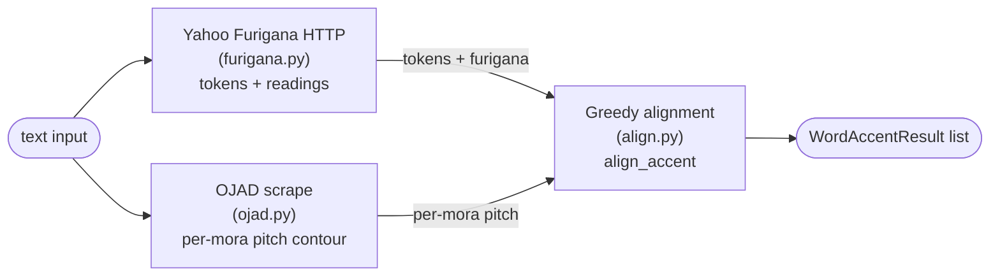

# `api/accent/` — Accent marking package

這個 package 提供兩個 FastAPI endpoint：

| Endpoint | 用途 |
|---|---|
| `POST /api/MarkAccent/` | 把日文標上 per-mora pitch accent + furigana |
| `POST /api/MarkFurigana/` | 只標 furigana (Yahoo Furigana 直出) |

兩個 endpoint 共用同一套 Yahoo Furigana tokenizer、同一組 Pydantic schema、以及同一條 HTTP client 池。

## Data flow



`/MarkFurigana/` 只走最上面那條（`text → yahoo → list[WordResult]`）。`/MarkAccent/` 走全圖。

## Core types (`models.py`)

### `WordResult` (Yahoo Furigana 輸出)

| 欄位 | 型別 | 說明 |
|---|---|---|
| `surface` | `str` | 原文 token |
| `furigana` | `str` | 該 token 的 hiragana 讀音 |
| `subword` | `list[WordResult]` | kanji + kana 混合 token 的細分（遞迴）|

### `AccentInfo` (per-mora pitch)

| 欄位 | 型別 | 說明 |
|---|---|---|
| `furigana` | `str` | 該 mora 的 kana |
| `accent_marking_type` | `int` | 見下方表 |
| `length` | `int` | kana 字數 |

`accent_marking_type` 三種值，對應 OJAD HTML 的 CSS class：

| 值 | 意義 | OJAD class | 視覺 |
|---|---|---|---|
| `0` | LOW（或未知 / fallback）| (無 class) | 低音 |
| `1` | HIGH plateau | `accent_plain` | 高音平台 |
| `2` | FALL kernel | `accent_top` | 此 mora 之後音調下降 |

### `WordAccentResult` (MarkAccent 輸出)

| 欄位 | 型別 | 說明 |
|---|---|---|
| `surface` | `str` | 原文 token |
| `furigana` | `str` | 全 token 讀音 |
| `accent` | `list[AccentInfo]` | per-mora pitch list |
| `subword` | `list[WordResult]` | 從 Yahoo 透傳，不額外處理 |

### Accent shape 速查

從 `accent` 陣列可以判斷整個 word 的音調型：

| Type | 判定條件 | 例 |
|---|---|---|
| 平板調 (Heiban) | 沒有 type=2，至少一個 type=1 | 学校 `[が:0 っ:1 こ:1 う:1]` |
| 頭高 (Atamadaka) | 第一個 mora 是 type=2 | 今日 `[きょ:2 う:0]` |
| 中高 (Nakadaka) | 中間某個 mora 是 type=2 | 山道 `[や:0 ま:1 み:2 ち:0]` |
| 尾高 (Odaka) | 最後一個 mora 是 type=2（FALL 落在 word 跟 particle 之間）| 橋 `[は:0 し:2]` |

## File responsibilities

| File | 角色 |
|---|---|
| `models.py` | Pydantic schemas（兩 endpoint 共用）|
| `furigana.py` | Yahoo Furigana JSON-RPC client（**data layer**，不是 endpoint）|
| `ojad.py` | OJAD scrape — `suzukikun.t.u-tokyo.ac.jp` + BeautifulSoup |
| `align.py` | Yahoo token ↔ OJAD mora alignment，含 punctuation / kana 判定 constants |
| `pipeline.py` | MarkAccent orchestrator：normalize → furigana → ojad → align |
| `routes.py` | FastAPI router + thin endpoint handlers |
| `__init__.py` | 對 `main.py` re-export `accent_router` / `furigana_router` |

依賴方向（無循環）：

```
routes.py  →  pipeline.py  →  align.py, furigana.py, ojad.py
                            ↘
                              models.py  ←  (所有層都 import models)
```

## Alignment algorithm (`align.py`)

`align_accent()` 是 in-order greedy 比對：對每個 Yahoo token 從目前的 OJAD 指標開始抓 mora 直到累積長度等於 Yahoo furigana 長度，然後比對是否 byte-identical（在 `kata2hira` 折疊下）。失敗的話 fall back 到 Yahoo furigana 配 `accent_marking_type=0`。

特殊分支：

- **Numeric token**（`numeric_pattern` 比對 surface）：沒有 Yahoo furigana 可比，改用 next-token anchor — 不停抓 OJAD mora 直到下一個 Yahoo token 的 reading 出現
- **Pure-punct token**（既不是 numeric 也不是 kana/kanji）：跳過比對，emit 一個 `accent_marking_type=0` 的占位；如果 OJAD 當前 mora 是 punct (`、 。 , .`) 也順手 advance OJAD 指標
- **kata2hira fold**：所有比對都先 `jaconv.kata2hira` 過，所以カタカナ readings 跟 ひらがな OJAD output 對得起來

> 注意：目前的 align 是 single-pass greedy，沒有 backtrack。後續 PR 會升級成 Needleman-Wunsch DP 並加入 rendaku tolerance、edit distance cost 等 — README 會跟著更新。

## Adding endpoints / overrides

- 新 endpoint：route 放 `routes.py`，邏輯 helper 拆到對應 layer（data layer 進 `furigana.py` / `ojad.py`，演算法進 `align.py`，整合進 `pipeline.py`）
- Surface-level override（日期、人名特殊讀音等）：未來會在這個 package 加 `reading_overrides.py`，由 `pipeline.py` 在 align 前後呼叫
- POS-driven 規則（ます / たい 等助動詞、形容詞）：未來會加 `apply_accent_patches`，由 `pipeline.py` 在 align 之後呼叫

兩者落地時這份 README 會補上對應段落。
