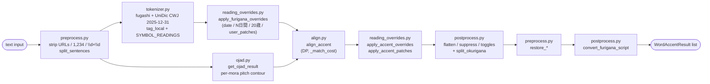

# `api/accent/` — Accent marking package

This package exposes two FastAPI endpoints:

| Endpoint | Purpose |
|---|---|
| `POST /api/MarkAccent/` | Marks the input text with per-mora pitch accent + furigana and returns a single `AccentResponse`. |
| `POST /api/MarkAccent/stream/` | Same pipeline, streams one NDJSON line per chunk in input order. |

Both endpoints share the same chunking / pipeline; only the delivery
shape differs. (The standalone `MarkFurigana` endpoint that lived in
earlier versions was removed during the local-UniDic migration —
there's no in-process furigana-only equivalent. Callers that need
raw tokenisation can import `tokenizer.tag_local` directly.)

## Data flow



`pipeline.process_accent_chunk` runs every step above on each
sentence-sized chunk; `build_chunks` / `schedule_chunks` fan chunks
across an in-flight semaphore shared between the collected and
streaming endpoints.

## Request toggles (`models.py`)

| Field | Type | Default | Meaning |
|---|---|---|---|
| `text` | `str` | required | The Japanese text to mark. |
| `render_english_furigana` | `bool` | `False` | When `True`, ASCII-letter tokens (`Apple`, `G2P`) emit their Japanese-style ruby. Tokens that already carry a Japanese reading (unit compounds like `53mm` / `33m/s` / `3kg`) keep both ruby and accent regardless of this flag — the wipe only fires when `furigana` contains no kana. |
| `render_katakana_furigana` | `bool` | `False` | When `True`, pure-katakana tokens (`カメラ`) emit a hiragana ruby (`かめら`). When `False`, both the top-level `furigana` AND every `AccentInfo.furigana` are cleared so clients that draw ruby from the per-mora field don't render hiragana overlays on katakana surfaces. `accent_marking_type` and `length` are preserved either way so pitch can still be drawn. |
| `script` | `Literal["hiragana","katakana","romaji"]` | `"hiragana"` | Output script for every furigana field (top-level, per-mora, subword). Internal alignment stays hiragana; this is a response-shape switch. Romaji uses jaconv's default Hepburn-style table — no macrons. |

## Core types (`models.py`)

### `WordResult`

| Field | Type | Description |
|---|---|---|
| `surface` | `str` | Original surface text fragment. |
| `furigana` | `str` | Token reading in hiragana. |
| `subword` | `list[WordResult]` | Filled by `split_okurigana` in postprocess for mixed kanji + kana surfaces (kanji runs carry their furigana slice; inline kana segments carry `furigana=""`). |

### `AccentInfo` (per-mora pitch)

| Field | Type | Description |
|---|---|---|
| `furigana` | `str` | This mora's kana (may be empty when a toggle suppressed it). |
| `accent_marking_type` | `int` | See the table below. |
| `length` | `int` | Number of surface chars this mora covers (multi-char for small kana like `ツァ` or `ぴょ`). |

`accent_marking_type` values mirror OJAD's HTML CSS classes:

| Value | Meaning | OJAD class | Visual |
|---|---|---|---|
| `0` | LOW (or unknown / fallback) | (no class) | low pitch |
| `1` | HIGH plateau | `accent_plain` | high pitch sustain |
| `2` | FALL kernel | `accent_top` | pitch drops AFTER this mora |

### `WordAccentResult` (MarkAccent response)

| Field | Type | Description |
|---|---|---|
| `surface` | `str` | Original surface fragment. |
| `furigana` | `str` | Full token reading. |
| `accent` | `list[AccentInfo]` | Per-mora pitch list. |
| `subword` | `list[WordResult]` | Kanji + kana segmentation (see above). |
| `kernel_absorbed` | `bool` | UniDic says this word has an accent kernel but OJAD's contour for its range carries no FALL — usually means the word sits in the medial position of a long prosodic phrase and OJAD's CRF collapsed its kernel into the surrounding contour. |

### Accent shape cheat-sheet

The shape of the whole word can be read off the `accent` list:

| Type | Test | Example |
|---|---|---|
| 平板 (Heiban) | no `type=2`, at least one `type=1` | 学校 `[が:0 っ:1 こ:1 う:1]` |
| 頭高 (Atamadaka) | first mora is `type=2` | 今日 `[きょ:2 う:0]` |
| 中高 (Nakadaka) | a middle mora is `type=2` | 山道 `[や:0 ま:1 み:2 ち:0]` |
| 尾高 (Odaka) | the last mora is `type=2` (FALL lands on the boundary with the following particle) | 橋 `[は:0 し:2]` |

## File responsibilities

| File | Role |
|---|---|
| `models.py` | Pydantic schemas (shared between both endpoints), `Request` toggles, strong-mode lexical-accent fields. |
| `tokenizer.py` | In-process fugashi + NINJAL UniDic CWJ 2025-12-31 tokeniser — `tag_local`. Includes the `SYMBOL_READINGS` fallback that fills katakana readings for `#`, `%`, `@`, … when UniDic returns no `kana`. |
| `preprocess.py` | Surface-layer URL / `1,234` / `\d×\d` strip + restore, `has_japanese` gate, `split_sentences`, `READABLE_SYMBOLS`, `SYMBOL_READINGS` table. |
| `ojad.py` | OJAD scrape against `gavo.t.u-tokyo.ac.jp/ojad/phrasing/index`, parsed with BeautifulSoup. |
| `align.py` | Needleman-Wunsch-style DP that aligns tokens against OJAD morae — `_match_cost`, edit distance, voicing fold, token kind classification. |
| `reading_overrides.py` | Regex overrides (dates, `N日間`, `20歳→はたち`, weekday `(土)` …) + POS-driven `apply_accent_patches` (ます / たい first-mora-FALL) + compiles `USER_PATCHES`. |
| `user_patches.py` | **User-maintained** patch table — literal-match overrides for cases where OJAD or UniDic produce the wrong reading. (Pure data; see the dedicated section below.) |
| `postprocess.py` | Rendering polish: suppress punct / particle furigana, flatten heiban-particle, English / katakana toggles, `split_okurigana`, `convert_furigana_script`. |
| `pipeline.py` | MarkAccent orchestrator — runs preprocess → tokenizer → overrides → ojad → align → patches → postprocess → restore → script convert. Provides the shared `build_chunks` / `schedule_chunks`. |
| `routes.py` | FastAPI router + the two endpoint handlers (collected and streaming). |
| `__init__.py` | Re-exports `accent_router` for `main.py`. |

Dependency direction (no cycles):

```
routes.py  →  pipeline.py  →  align.py, ojad.py, tokenizer.py,
                              preprocess.py, postprocess.py,
                              reading_overrides.py  →  user_patches.py
                            ↘
                              models.py  ←  (every layer imports models)
```

## Alignment algorithm (`align.py`)

`align_accent()` runs a Needleman-Wunsch-style DP over the (token,
OJAD entry) lattice. `dp[i][j]` is the lowest total cost of aligning
tokens `[0..i)` to OJAD entries `[0..j)`. At each `(i, j)` the inner
loop tries letting token `i` consume `k ∈ [0, _K_MAX]` OJAD entries;
the per-token cost comes from `_match_cost`.

Cost branches, in the order `_match_cost` checks them:

- **Punctuation token** — `k=0` is cost 0, `k=1` matching the same
  punct char is cost 0, everything else is `_INF`.
- **English-compound** (letters / digits / `-_.`) — `k=0` is cost
  **0** (OJAD frequently elides English entirely; e.g. it returns
  only the 4 morae of `ふりがな` for `ふりがなWhisper`). `k≥1` is
  cost 0 up to `max(4, len*4)` with a linear over-cap penalty.
  Checked BEFORE the punct guard because OJAD sometimes injects a
  mid-stream `。` when normalising `Wifi.7` → `Wifi。7`; that
  artefact has to be absorbed by the merged token.
- **OJAD-punct guard** — for everything below this point, an OJAD
  span containing `、 。 , .` etc. is rejected with `_INF`, blocking
  the leak of punct morae onto kana neighbours.
- **Readable-compound** (e.g. `2%` if synthesised upstream) — same
  free-consume as numeric, with the upper bumped by 8 morae to
  accommodate the symbol's spoken reading.
- **Numeric token** — accepts `k ∈ [1, max(4, len*4)]` at cost 0,
  linear penalty beyond. A 0.01 tiebreaker on span-internal empty
  OJAD entries keeps `19×19` from being sliced as 1+7.
- **Synthesized token** (override-merged, both `base` and `pos` are
  None) — `20歳→はたち` style merges have a prescribed `furigana`
  whose mora count usually doesn't match OJAD's reading of the
  underlying surface (`にじゅっさい`). Free-consume like
  readable_compound so OJAD morae land on this token rather than
  cascading onto a kana neighbour. `apply_accent_overrides` rewrites
  the accent post-align, so the marks DP picked up from OJAD are
  discarded anyway.
- **Kana / kanji token** — `_edit_distance` over rendaku-folded
  strings (`sub=0.4`, `ins/del=1.0`), gated by a length pre-filter
  (diff > 3 returns `_INF`).

**Voicing fold (`_VOICING_FOLD`)** — applied before the edit-distance
comparison to absorb rendaku / sequential voicing (`が↔か`, `ぷ↔ふ`,
…).

`_build_word_result` turns each (token, OJAD span) pair into a
`WordAccentResult` and stamps the three strong-mode fields
(`lexical_kernel`, `lexical_kernel_alts`, `kernel_absorbed`).
Pure-punct tokens emit empty `furigana` + empty `accent`;
numeric / readable-compound use the OJAD span to synthesise the
displayed furigana.

## Surface overrides + POS patches (`reading_overrides.py`)

Two layers run outside the DP aligner:

**(1) Whole-string regex overrides** — `OVERRIDES` is composed of
`_day_of_week_overrides`, `_date_overrides`, `_duration_overrides`,
`_age_overrides`, and `_user_patch_overrides` (compiled from
`user_patches.USER_PATCHES`). Each rule is a `FuriganaOverride
(pattern, replacements, description, pos_match=None)`:

- `apply_furigana_overrides(words: list[WordResult])` runs **before**
  OJAD alignment to merge spans like `4日`, `27日`, `1日間`, `20歳`
  into single tokens with the correct reading.
- `apply_accent_overrides(words: list[WordAccentResult])` runs
  **after** OJAD alignment and rewrites both furigana and accent in
  one pass.
- Patterns use the not-numeric lookbehind / lookahead built on
  `_DIGIT_CLASS = \d一二三四五六七八九十百千` so `11日` isn't
  misfired as `1日`. `_numeric_pattern(n)` accepts the arabic,
  full-width, and traditional-kanji variants of the same number.
- `_apply` joins token surfaces back into a string, filters matches
  against token boundaries, and lets an optional `pos_match`
  callback reject matches on POS grounds.
- User patches sit at the **tail** of the OVERRIDES list. The
  `(start, -length)` tiebreak in `_collect_matches` means longer
  built-in patterns (`N日間` over `N日`) still win when they overlap.

**(2) POS-driven `apply_accent_patches`** — runs after (1) and
inspects each token's MA metadata to patch the trailing accent.
Currently covers:

- `_is_masu_auxiliary` — `pos=助動詞 ∧ cType=助動詞-マス ∧
  base=ます ∧ surface.startswith("ま") ∧ cForm ∈ {終止形, 連用形}`
  → first mora FALL, rest LOW.
- `_is_tai_auxiliary` — same patch for `cType=助動詞-タイ ∧
  base=たい`.

Override-replaced tokens have `pos=None`, so the patch predicates
auto-reject them and the two layers compose safely.

## User patches (`user_patches.py`)

Pure data file for cases where OJAD or UniDic produce a wrong reading
that we want to override locally without changing the upstream.

Schema:

```python
USER_PATCHES: dict[str, tuple[tuple[str, str, tuple[int, ...]], ...]] = {
    "33m/s": (
        ("33", "さんじゅうさん", (0, 1, 1, 1, 1, 1)),
        ("m/s", "めーとるまいびょう", (1, 1, 1, 1, 1, 1, 1, 1)),
    ),
    "他の": (
        ("他", "ほか", (2, 0)),    # atamadaka
        ("の", "の", (0,)),
    ),
}
```

Every segment is a 3-tuple `(surface, furigana, accent_ints)`:

- `accent_ints` is a per-mora integer tuple, where `0`=LOW, `1`=HIGH,
  `2`=FALL.
- Length MUST equal the mora count of `furigana` (small kana
  `ゃ/ゅ/ょ` attach to the preceding mora — `じゅ` counts as one
  entry).
- Concatenating every segment's `surface` MUST equal the dict key.

Validation failures (non-3-tuple segments, surface length mismatch,
accent length mismatch) emit a startup warning and the entry is
skipped wholesale.

Common shapes:

| Shape | accent_ints example (3 morae) |
|---|---|
| heiban | `(1, 1, 1)` |
| atamadaka | `(2, 0, 0)` |
| nakadaka | `(0, 1, 2, 0)` (FALL in the middle) |
| odaka | `(0, 0, 2)` |
| all-LOW (particle-style) | `(0, 0, 0)` |

To add an entry:

1. Reproduce the misalignment via `POST /api/MarkAccent/` and
   confirm it's deterministic.
2. Append a line to `USER_PATCHES` — start with a heiban
   `(1, 1, …)` if unsure.
3. Run `./scripts/run_10_tests.sh` to confirm no regression on the
   30-fixture corpus.
4. Tune `accent_ints` by ear if the pitch matters.

## Postprocess passes (`postprocess.py`)

`pipeline` runs these in order after align + overrides + patches:

1. `flatten_heiban_particle_accent` — collapses the trailing
   `の/な/は/が` particle's accent to all-LOW after a 平板 noun so
   OJAD's heiban-continuation HIGH overlay doesn't leak across the
   noun→particle boundary.
2. `suppress_punct_furigana` — clears `furigana` and `accent` on
   pure-punct tokens. Surfaces present in `SYMBOL_READINGS` (`#`,
   `%`, `@`, …) are excluded so their reading isn't accidentally
   wiped.
3. `apply_furigana_toggles` — when `render_english_furigana=False`,
   clears `furigana` AND `accent` on pure-English tokens; **unit
   compounds** (`53mm`, `33m/s`, `3kg`) are exempt because their
   furigana contains kana. When `render_katakana_furigana=False`,
   clears the top-level `furigana` AND every `AccentInfo.furigana`
   on pure-katakana tokens while preserving `accent_marking_type` +
   `length` so the pitch overlay can still be drawn against the
   surface chars.
4. `suppress_particle_furigana` — clears the top-level `furigana`
   on `pos=="助詞"` tokens; per-mora `accent` is kept so the pitch
   overlay still renders.
5. `split_okurigana` — for surfaces that mix kanji and kana
   (`聞き分け`, `取り組み`, `飲んで`, …), populates `subword[]`
   with one entry per surface segment: kanji runs carry their
   furigana slice, inline kana segments carry `furigana=""`.
   Tokens that can't be aligned cleanly (irregular reading; no
   kanji) are left flat — no garbled segments.
6. `restore_*` (in `preprocess.py`) — restores URLs, `1,234`-style
   commas, and `\d×\d` separators on the surfaces.
7. `convert_furigana_script` — rewrites every furigana field
   (top-level, per-mora, subword) into the requested `script`.
   Even the default `"hiragana"` runs through here so per-mora
   morae that OJAD echoed back as katakana (`ラ`, `イ` on
   `ライター`) get normalised to hiragana — without this pass the
   per-mora script was inconsistent between katakana-surface and
   kanji-surface tokens.

Every pass is a pure function (input is not mutated) and
idempotent. Order matters: the English / katakana toggle has to
run before particle suppression, and `convert_furigana_script`
must run last so it sees the final shape.

## Local UniDic tokeniser (`tokenizer.py`)

`tag_local(text) -> list[WordResult]` is the public entry point.
A module-level `fugashi.Tagger()` singleton keeps the ~1.3 GB
dictionary loaded between requests. Field mapping:

| WordResult field | UniDic feature |
|---|---|
| `surface` | `token.surface` |
| `furigana` | `jaconv.kata2hira(feat.kana)`, falling back through `feat.pron` → `SYMBOL_READINGS[surface]` (for `#`, `%`, … which have no UniDic reading) → the surface itself |
| `base` | `_strip_lemma_gloss(feat.lemma)` (drops the English gloss from `コーヒー-coffee`) |
| `pos` | `feat.pos1` (top-level POS: 動詞 / 助動詞 …) |
| `pos1` | `feat.pos2` (subcategory: 一般 / 普通名詞 …) |
| `conjugation_type` | `feat.cType` |
| `conjugation_form` | `feat.cForm` |
| `lexical_kernel` / `lexical_kernel_alts` | `_parse_atype(feat.aType)` (single reading → primary; `"2,0"` → primary + alts) |

UniDic uses `*` as a null marker; `_none_if_null` maps every `*` to
`None`. We prefer `feat.kana` (orthographic kana — `イソガシイ`,
which aligns to OJAD's output) over `feat.pron` (phonological —
`イソガシー` with chōonpu, which never aligns).

The five POS metadata fields (`base` / `pos` / `pos1` /
`conjugation_type` / `conjugation_form`) are marked
`Field(exclude=True)` in `models.py` — used internally by
`apply_accent_patches` and by `align._match_cost`'s synthesized-
token detection (`base is None and pos is None`), but the
serialised response omits them. The three strong-mode fields
(`lexical_kernel`, `lexical_kernel_alts`, `kernel_absorbed`) DO
appear in the JSON.

## Adding endpoints / overrides

- **New endpoint** — add the route in `routes.py`, layer the logic
  across `tokenizer.py` / `align.py` / `ojad.py` /
  `reading_overrides.py` / `postprocess.py`, then thread it into
  `pipeline.py`.
- **User-level patch** (most common) — append an entry to
  `USER_PATCHES` in `user_patches.py`. Pure data; no Python needed.
- **Structural surface override** (regex patterns, multi-surface
  variants, POS conditions) — add a new `_*_overrides()` factory
  in `reading_overrides.py` and concat its result into `OVERRIDES`.
- **POS-driven rule** — add an `_is_*_auxiliary` predicate and a
  matching `_patch_*` builder in `reading_overrides.py`, then wire
  them into the `apply_accent_patches` loop.
- **New `SYMBOL_READINGS` entry** — add `"X": "カタカナ"` to the
  dict in `preprocess.py`. Both `tag_local` and
  `suppress_punct_furigana` automatically pick up the new surface.
